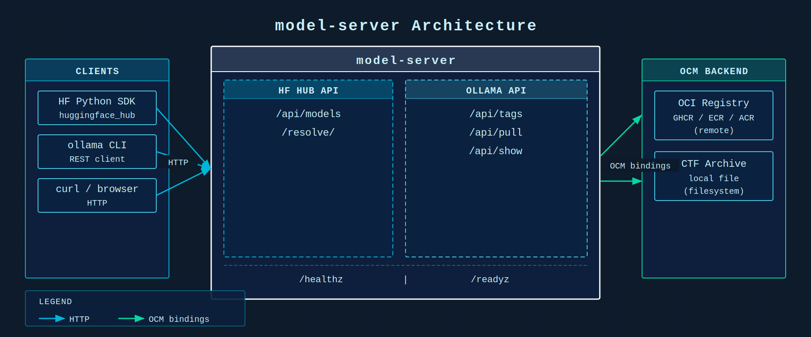

# model-server

A Go server that makes OCM (Open Component Model) repositories look like Hugging Face Hub and Ollama registries. Models are stored as signed, versioned OCM components in OCI registries. Clients — the HF Python SDK, `ollama` CLI, or plain `curl` — work without modification.

## Overview



- **No inference.** No proxying. Pure model distribution.
- **Supply-chain traceability** via OCM signatures and provenance.
- **Multi-registry**: serve from GHCR, AWS ECR, Azure ACR, or a local CTF file.
- **Dual API surface**: HF Hub-compatible + Ollama-compatible, simultaneously.

## Quick Start

### 1. Build

```bash
make build          # produces bin/model-server
# or
go build -o bin/model-server ./cmd/model-server
```

### 2. Configure

Create `model-server.yaml` (see `examples/config/model-server.yaml` for a full reference):

```yaml
server:
  listen: ":8080"

auth:
  mode: none          # or "bearer" with tokensFile

ocm:
  repositories:
    - name: primary
      type: OCIRegistry
      url: ghcr.io/my-org/models
      credentialsRef: ghcr-creds

  signatures:
    required: false   # set true in production

apis:
  hfhub:
    enabled: true
  ollama:
    enabled: true

credentials:
  ghcr-creds:
    username: ${GHCR_USERNAME}
    password: ${GHCR_TOKEN}
```

For a local CTF archive (useful for testing):

```yaml
ocm:
  repositories:
    - name: local
      type: CTF
      url: /path/to/models.ctf
```

### 3. Run

```bash
bin/model-server -config model-server.yaml
```

---

## Storing Models as OCM Components

Each model is an OCM component version. The server discovers models by reading
the `ext.ocm.software/model-server.*` label namespace on component versions.

### Required labels (on the component)

| Label | Description | Example |
|---|---|---|
| `ext.ocm.software/model-server.model-id` | Public model identifier | `meta-llama/Llama-3-8B` |
| `ext.ocm.software/model-server.task` | Pipeline task | `text-generation` |

### Optional labels (on the component)

| Label | Description | Example |
|---|---|---|
| `ext.ocm.software/model-server.library` | Framework | `transformers` |
| `ext.ocm.software/model-server.family` | Model family | `llama` |
| `ext.ocm.software/model-server.license` | License identifier | `apache-2.0` |
| `ext.ocm.software/model-server.gated` | Gated model | `true` |
| `ext.ocm.software/model-server.private` | Private model | `true` |

### Resource labels (on each resource within the component)

| Label | Description | Example |
|---|---|---|
| `ext.ocm.software/model-server.filename` | File name exposed to clients | `config.json` |
| `ext.ocm.software/model-server.format` | Format hint for MIME type | `safetensors`, `gguf`, `json` |
| `ext.ocm.software/model-server.lfs` | Serve as large file | `true` |

### Resource types

| OCM type | Purpose |
|---|---|
| `modelWeights` | Model weights (`*.safetensors`, `*.gguf`, `*.bin`) |
| `modelConfig` | `config.json`, `tokenizer_config.json`, etc. |
| `modelCard` | `README.md` |
| `tokenizer` | Tokenizer files |

See `examples/component/component-constructor.yaml` for a full OCM component definition.

---

## Usage Examples

### Hugging Face Python SDK

Point the SDK at the server with `HF_ENDPOINT`:

```python
import os
os.environ["HF_ENDPOINT"] = "http://localhost:8080"

from huggingface_hub import HfApi, hf_hub_download

api = HfApi(endpoint="http://localhost:8080", token="any")

# List all models
for model in api.list_models():
    print(model.id, model.pipeline_tag)

# Model metadata
info = api.model_info("meta-llama/Llama-3-8B")
print(info.card_data.license)
print([s.rfilename for s in info.siblings])

# List files
for entry in api.list_repo_tree("meta-llama/Llama-3-8B"):
    print(entry.path, entry.size)

# Download a file
path = hf_hub_download(
    repo_id="meta-llama/Llama-3-8B",
    filename="config.json",
    endpoint="http://localhost:8080",
    token="any",
)
print(open(path).read())
```

With `transformers`, set the endpoint before loading:

```python
import os
os.environ["HF_ENDPOINT"] = "http://localhost:8080"

from transformers import AutoConfig
config = AutoConfig.from_pretrained("meta-llama/Llama-3-8B", token="any")
```

### Ollama CLI

```bash
export OLLAMA_HOST=http://localhost:8080

# List available models
ollama list

# Show model details
ollama show meta-llama/Llama-3-8B

# Pull model files to local cache
ollama pull meta-llama/Llama-3-8B
```

### curl

```bash
BASE=http://localhost:8080

# List models
curl $BASE/api/models | jq '.[].id'

# Filter by task
curl "$BASE/api/models?task=text-generation" | jq '.[].id'

# Model info
curl $BASE/api/models/meta-llama/Llama-3-8B | jq '{id, pipeline_tag, license: .cardData.license}'

# File tree
curl $BASE/api/models/meta-llama/Llama-3-8B/tree/main | jq '.[].path'

# Download a file
curl -L $BASE/meta-llama/Llama-3-8B/resolve/main/config.json

# Ollama: list models
curl $BASE/api/tags | jq '.models[].name'

# Ollama: show model details
curl -X POST $BASE/api/show -d '{"name":"meta-llama/Llama-3-8B"}' | jq .

# Ollama: stream pull progress
curl -X POST $BASE/api/pull -d '{"name":"meta-llama/Llama-3-8B"}'
```

---

## API Reference

### Hugging Face Hub

| Method | Path | Description |
|---|---|---|
| `GET` | `/api/models` | List models (`?search=`, `?task=`, `?limit=`, `?skip=`) |
| `GET` | `/api/models/{owner}/{model}` | Model metadata + file list |
| `GET` | `/api/models/{owner}/{model}/tree/{revision}` | File tree |
| `GET/HEAD` | `/{owner}/{model}/resolve/{revision}/{file}` | Download or stat a file |
| `GET/HEAD` | `/{owner}/{model}/raw/{revision}/{file}` | Raw file access |

### Ollama

| Method | Path | Description |
|---|---|---|
| `GET` | `/api/tags` | List stored models |
| `POST` | `/api/show` | Model info (`{"name":"..."}`) |
| `POST` | `/api/pull` | Pull model, streams NDJSON progress |

### Health

| Method | Path | Description |
|---|---|---|
| `GET` | `/healthz` | Liveness probe |
| `GET` | `/readyz` | Readiness probe (index built) |

---

## Development

```bash
# Run all tests
make test

# Run integration tests only
go test ./test/integration/... -v

# Test coverage (target: ≥80%)
make cover

# Vet
make vet
```

---

## Further Reading

- `docs/architecture.md` — system architecture and component diagrams
- `docs/proposal.md` — design rationale and OCM mapping
- `examples/component/component-constructor.yaml` — full OCM component definition
- `examples/config/model-server.yaml` — full server configuration reference
