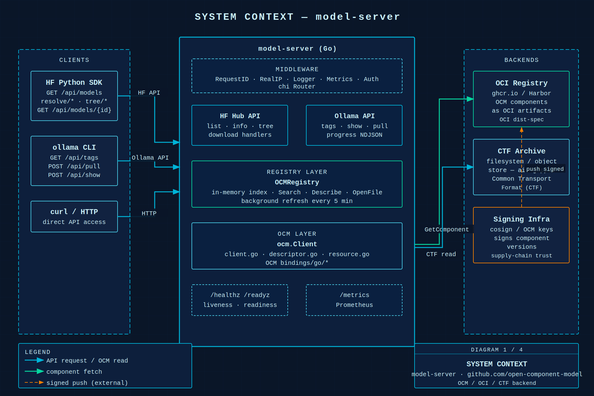
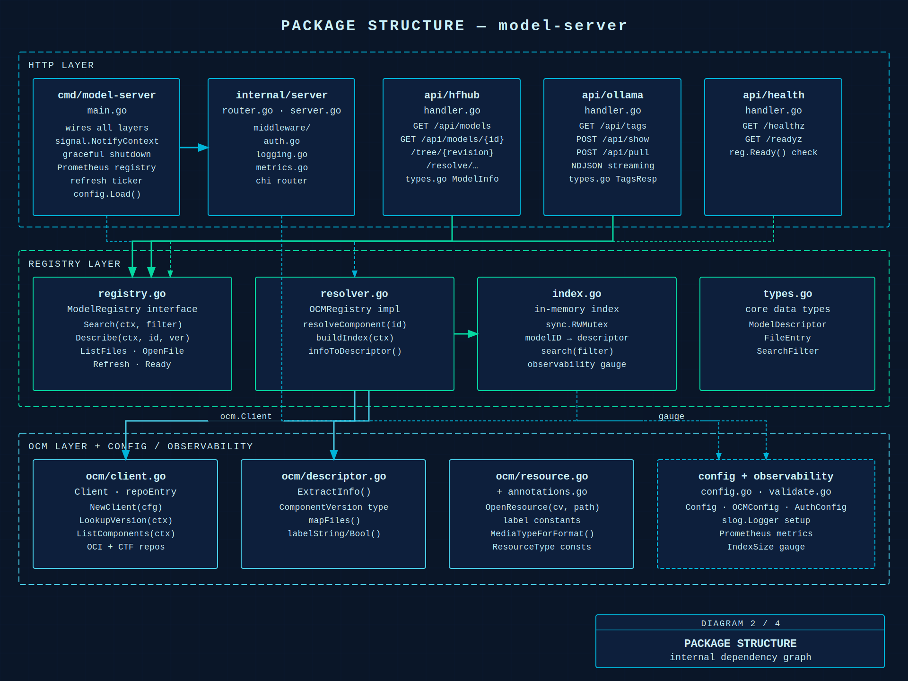
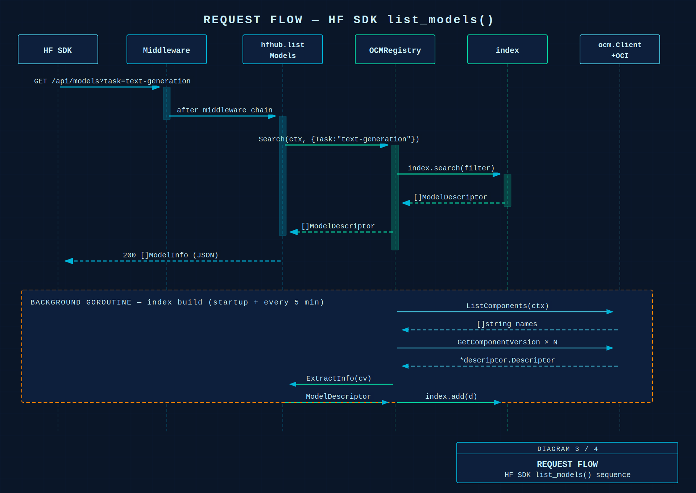
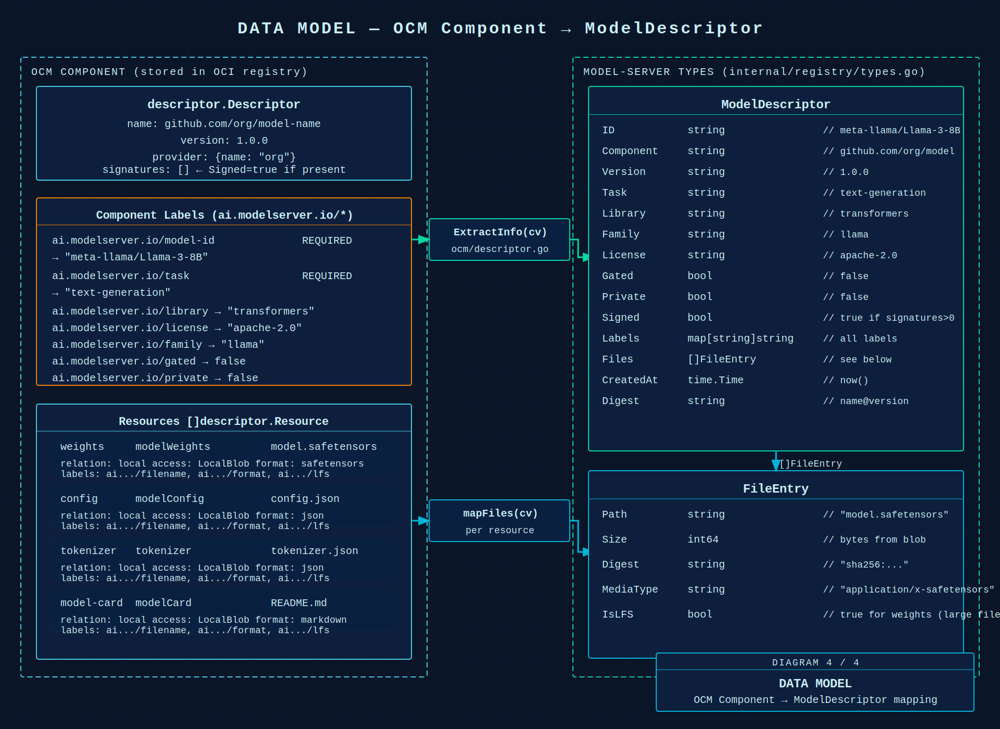

# Architecture Diagrams

Diagrams generated with [fireworks-tech-graph](https://github.com/yizhiyanhua-ai/fireworks-tech-graph), blueprint style.
Source SVGs in `docs/diagrams/` — PNG exports at 2x resolution.

---

## 1. System Context

How model-server sits between AI clients and OCM-backed OCI registries.

---

## 2. Package / Component Structure

Internal Go package dependency graph, grouped by layer.

---

## 3. Request Flow — HF SDK `list_models()`

Sequence from client call through middleware, handler, registry, and the background index-build goroutine.

---

## 4. Data Model — OCM Component → ModelDescriptor

How an OCM component descriptor (labels + resources) maps to model-server's internal `ModelDescriptor` and `FileEntry` types.

---

## Label Schema

| Label | Required | Example |
|---|---|---|
| `ext.ocm.software/model-server.model-id` | yes | `meta-llama/Llama-3-8B` |
| `ext.ocm.software/model-server.task` | yes | `text-generation` |
| `ext.ocm.software/model-server.library` | no | `transformers` |
| `ext.ocm.software/model-server.license` | no | `apache-2.0` |
| `ext.ocm.software/model-server.family` | no | `llama` |
| `ext.ocm.software/model-server.base-model` | no | `meta-llama/Llama-3` |
| `ext.ocm.software/model-server.gated` | no | `true` |
| `ext.ocm.software/model-server.private` | no | `false` |

## Format → Media Type

| Format | Media Type |
|---|---|
| `safetensors` | `application/x-safetensors` |
| `gguf` | `application/x-gguf` |
| `pytorch` | `application/x-pytorch` |
| `onnx` | `application/x-onnx` |
| `json` | `application/json` |
| `markdown` | `text/markdown` |
| _(default)_ | `application/octet-stream` |
